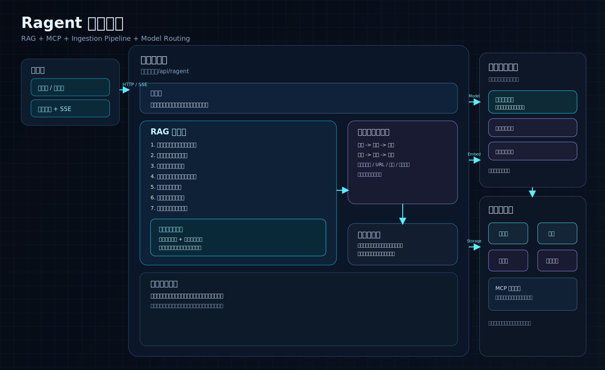
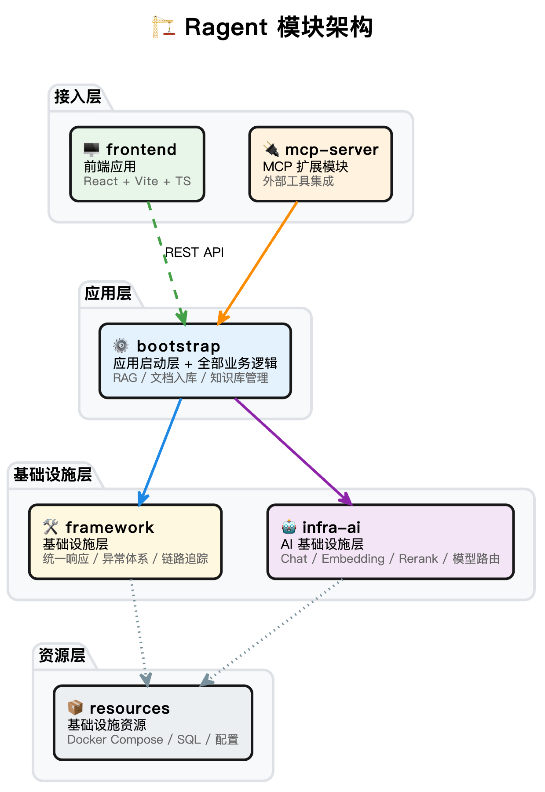
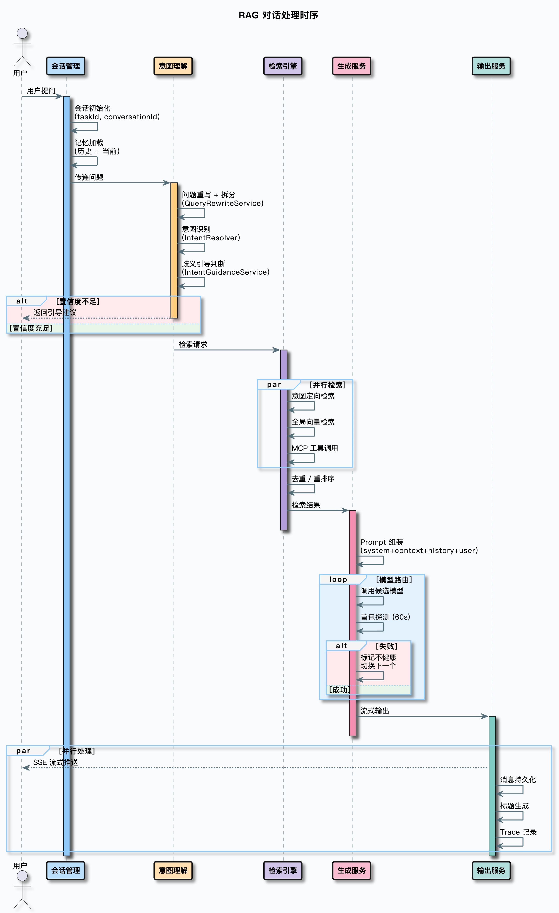
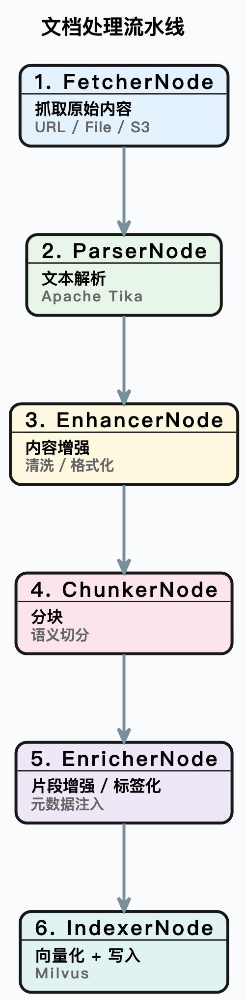
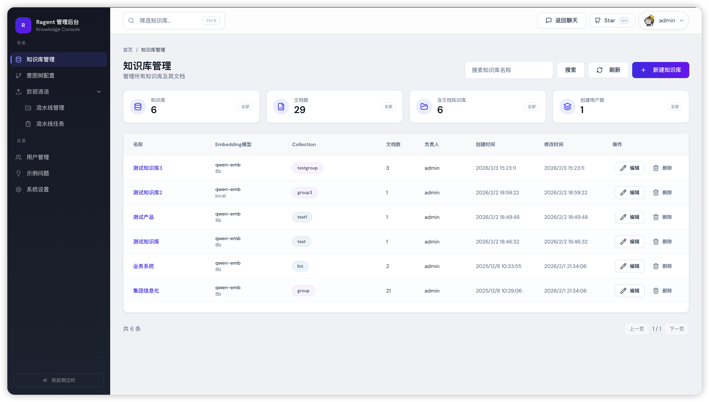
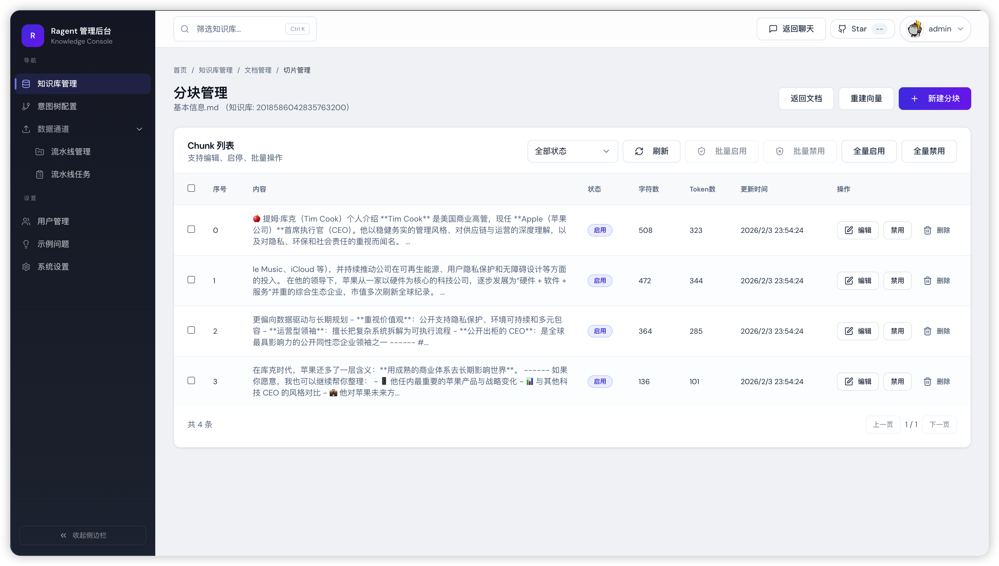
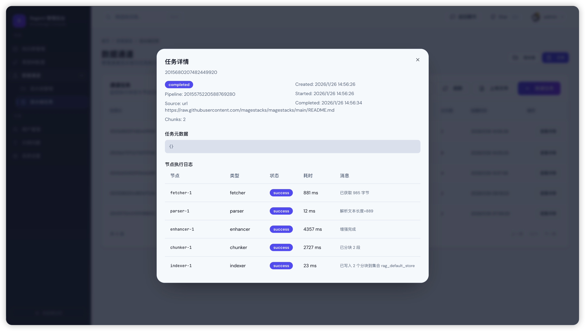
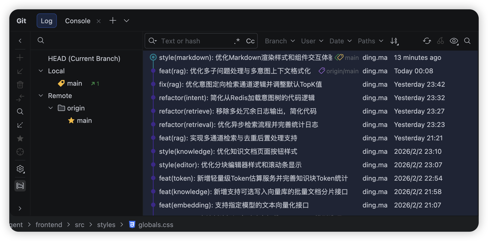

# Ragent AI

## 项目介绍

问答页面预览图：

具体来说，Ragent 包含以下核心能力：

- **多路检索引擎**：意图定向检索 + 全局向量检索并行执行，结果经去重、重排序后处理，兼顾精准度与召回率。

- **意图识别与引导**：树形多级意图分类（领域→类目→话题），置信度不足时主动引导澄清，而非硬猜答案。
- **问题重写与拆分**：多轮对话自动补全上下文，复杂问题拆为子问题分别检索，解决"说的不是想问的"。
- **会话记忆管理**：保留近 `N` 轮对话，超限自动摘要压缩，控 `Token` 成本不丢上下文。
- **模型路由与容错**：多模型优先级调度、首包探测、健康检查、自动降级，单模型故障不影响服务。
- **MCP 工具集成**：意图非知识检索时自动提参调用业务工具，检索与工具调用无缝融合。
- **文档入库ETL**：节点编排 `Pipeline`，从抓取、解析、增强、分块、向量化到写入 `Milvus`，灵活配置可扩展。
- **全链路追踪**：重写、意图、检索、生成每个环节均有 `Trace` 记录，排查与调优有据可依。
- **管理后台**：`React` 管理界面，覆盖知识库管理、意图树编辑、入库监控、链路追踪、系统设置。

## 目录

- [什么是 Ragent？](#什么是-ragent)
- [Ragent 核心设计](#ragent-核心设计)
    - [1. 技术架构](#1-技术架构)
    - [2. RAG 核心流程](#2-rag-核心流程)
        - [2.1 Ragent 链路](#21-ragent-链路)
        - [2.2 多路检索架构](#22-多路检索架构)
        - [2.3 模型路由与容错](#23-模型路由与容错)
    - [3. 文档入库流水线](#3-文档入库流水线)
    - [4. 关键设计模式](#4-关键设计模式)
- [项目质量怎么样？](#项目质量怎么样)
    - [1. 代码规模](#1-代码规模)
    - [2. 工程规范](#2-工程规范)
    - [3. 可扩展性](#3-可扩展性)
    - [4. 生产级特性](#4-生产级特性)
    - [5. 精美控制台](#5-精美控制台)
        - [5.1 用户问答](#51-用户问答)
        - [5.2 管理后台](#52-管理后台)
    - [6. 和市面上项目的区别](#6-和市面上项目的区别)

## 什么是 Ragent？

Ragent 是一个企业级 RAG 智能体平台，基于 Java 17 + Spring Boot 3 + React 18 构建。

它不是一个跑通 Demo 就收工的玩具项目，而是覆盖了 RAG 系统从文档入库到智能问答全链路的完整工程实现。在企业里做 RAG 会遇到的问题——文档解析、分块策略、多路检索、意图识别、问题重写、会话记忆、模型容错、MCP 工具调用、链路追踪——Ragent 里都有对应的解决方案。

## Ragent 核心设计

### 1. 技术架构

Ragent 采用前后端分离的单体架构，后端按职责分为四个 Maven 模块：

这个分层不是为了炫技，而是解决实际问题：`framework` 层提供与业务无关的通用能力，`infra-ai` 层屏蔽不同模型供应商的差异，`bootstrap` 层专注业务逻辑。换模型供应商不用改业务代码，换业务逻辑不用动基础设施。

技术栈选型：

| 层面       | 技术选型                                                     |
| ---------- | ------------------------------------------------------------ |
| 后端框架   | Java 17、Spring Boot 3.5.7、MyBatis Plus                     |
| 前端框架   | React 18、Vite、TypeScript                                   |
| 关系数据库 | MySQL（20 多张业务表）                                       |
| 向量数据库 | Milvus 2.6                                                   |
| 缓存/限流  | Redis + Redisson                                             |
| 对象存储   | S3 兼容存储（RustFS）                                        |
| 消息队列   | RocketMQ 5.x                                                 |
| 文档解析   | Apache Tika 3.2                                              |
| 模型供应商 | 百炼（阿里云）、SiliconFlow、Ollama（本地）、vLLM（后续扩展） |
| 认证鉴权   | Sa-Token                                                     |
| 代码规范   | Spotless（自动格式化）                                       |

### 2. RAG 核心流程

#### 2.1 Ragent 链路

一次用户提问，在 Ragent 里经过的完整链路如下：

#### 2.2 多路检索架构

检索是 RAG 系统的核心，Ragent 的检索引擎采用多通道并行 + 后处理流水线的架构：

每个通道独立执行、互不影响，通过线程池并行调度。后处理器按顺序串联，像流水线一样逐步精炼检索结果。

#### 2.3 模型路由与容错

生产环境不可能只依赖一个模型供应商，Ragent 的模型路由机制解决的就是这个问题：

关键设计：首包探测阶段会缓冲所有事件，确保模型切换时用户端不会收到半截的脏数据。

### 3. 文档入库流水线

文档从上传到可检索，经过一条基于节点编排的 Pipeline：

每个节点的配置存储在数据库中，支持条件执行和输出链式传递。每个任务和节点都有独立的执行日志，出了问题能精确定位到哪一步。

### 4. 关键设计模式

Ragent 不是为了用设计模式而用，每个模式都对应一个具体的工程问题：

| 设计模式   | 应用场景                                      | 解决的问题                               |
| ---------- | --------------------------------------------- | ---------------------------------------- |
| 策略模式   | SearchChannel、PostProcessor、MCPToolExecutor | 检索通道、后处理器、MCP 工具可插拔替换   |
| 工厂模式   | IntentTreeFactory、StreamCallbackFactory      | 复杂对象的创建逻辑集中管理               |
| 注册表模式 | MCPToolRegistry、IntentNodeRegistry           | 组件自动发现与注册，新增工具零配置       |
| 模板方法   | IngestionNode 基类                            | 入库节点统一执行流程，子类只关注核心逻辑 |
| 装饰器模式 | ProbeBufferingCallback                        | 在不修改原有回调的前提下增加首包探测能力 |
| 责任链模式 | 后处理器链、模型降级链                        | 多个处理步骤按顺序串联，灵活组合         |
| 观察者模式 | StreamCallback                                | 流式事件的异步通知                       |
| AOP        | @RagTraceNode、@ChatRateLimit                 | 链路追踪和限流逻辑与业务代码解耦         |

## 项目质量怎么样？

说一个项目是企业级，不能光靠嘴说，得看实际的工程质量。从几个维度来评估 Ragent：

### 1. 代码规模

- 后端 Java 代码：约 40000 行，覆盖 400+ 个源文件
- 前端 TypeScript/React 代码：约 18000 行
- 数据库设计：20 张业务表，涵盖会话、消息、知识库、文档、分块、意图树、入库流水线、链路追踪、用户等完整业务域
- 前端页面：22 个页面/组件，包含聊天界面、管理后台（仪表板、知识库管理、意图树编辑、入库监控、链路追踪、用户管理、系统设置）

这不是一个周末能撸完的 Demo，是一个有完整业务闭环的系统。

### 2. 工程规范

- **分层架构**：framework / infra-ai / bootstrap 三层职责清晰，不存在基础设施代码和业务代码混在一起的问题。
- **framework 基础设施层**：独立 Maven 模块，23 个类覆盖 10 个横切关注点——三级异常体系 + 统一异常拦截、双维度幂等、Snowflake 分布式 ID 算法、用户上下文与 Trace 上下文跨线程透传、`SseEmitterSender` 线程安全 SSE 封装、统一响应体与错误码规范。业务模块只需引入依赖和加注解，零样板代码。
- **队列式并发限流**：基于 Redis 信号 + 有序集合（ZSET）+ Pub/Sub 通知实现分布式排队限流。请求先入 ZSET 排队，通过 Lua 脚本原子判断是否在队头窗口内再出队，信号量控制最大并发数并支持许可自动过期（防死锁）。跨实例通过 Pub/Sub 广播唤醒，本地合并通知避免惊群效应。排队超时自动踢出，全程 SSE 推送排队状态。
- **8 个专用线程池 + TTL 透传**：按工作负载特征配置了 8 个独立线程池（MCP 批量调用、RAG 上下文组装、多路检索、内部检索、意图分类、记忆摘要、模型流式输出、对话入口），队列类型和拒绝策略各不相同。所有线程池都用 `TtlExecutors` 包装，确保用户上下文和 Trace 信息在异步线程中不丢失。

- **三态熔断器**：实现了经典的三态熔断器（CLOSED → OPEN → HALF_OPEN），每个模型独立维护健康状态。失败次数达到阈值自动熔断，冷却期后进入半开状态放行探测请求，探测成功恢复、失败继续熔断。配合优先级降级链，一个模型挂了自动切到下一个候选，业务层无感知。
- **设计模式实战**：项目中落地了多种经典设计模式——策略模式、工厂模式、观察者模式、装饰器模式、模板方法模式、责任链模式、外观模式。不是为了用模式而用，每个都解决了实际的扩展性或解耦问题。

### 3. 可扩展性

这是衡量一个项目是否企业级的关键指标。Ragent 的核心模块都预留了扩展点：

- **新增检索通道**：实现 `SearchChannel` 接口，注册为 Spring Bean，自动生效。
- **新增后处理器**：实现 `SearchResultPostProcessor` 接口，自动加入处理链。
- **新增 MCP 工具**：实现 `MCPToolExecutor` 接口，自动被 `DefaultMCPToolRegistry` 发现。
- **新增入库节点**：实现 `IngestionNode` 接口，可插入 Pipeline 任意位置。
- **新增模型供应商**：在 `infra-ai` 层实现 `ChatClient` 接口，配置候选列表即可参与路由。

不需要改框架代码，不需要改配置文件里的硬编码列表，加个实现类就完事了。这才是面向接口编程的正确打开方式。

### 4. 生产级特性

很多开源项目做到“能跑”就停了，Ragent 还考虑了这些生产环境必须面对的问题：

- **限流**：支持全局并发限制和用户级限流，防止模型调用被打爆。
- **熔断**：模型健康检查 + 失败计数，自动熔断不可用的模型，避免反复超时。
- **可观测性**：基于 AOP 的全链路 Trace，每个环节的耗时、输入输出、异常信息都有记录。
- **流式输出**：SSE 实时推送，首包探测机制保证模型切换时用户无感知。
- **会话管理**：记忆压缩、摘要持久化、TTL 过期，不会因为聊天轮次多了就 OOM 或者 Token 爆炸。
- **认证鉴权**：基于 Sa-Token 的用户认证体系，不是裸奔的 API。

### 5. 精美控制台

Ragent 提供完整的可视化控制台，覆盖**普通用户与管理员用户**两类使用场景，界面简洁直观，操作高效便捷。

系统通过多轮 AI 辅助设计优化，在保证功能完整性的同时，提供更加现代化和友好的交互体验。

#### 5.1 用户问答

用户访问 Ragent 首页后，可在输入框中直接输入问题发起问答，同时支持开启**深度思考模式**以获得更高质量的回答。

输入框下方提供示例问题标签，用户点击即可自动填充问题，方便快速体验系统能力。

系统界面如下：

- 支持自然语言输入
- 支持示例问题快速填充
- 支持深度思考模式

问答界面示例：

用户提交问题后，模型会实时生成回答结果，并提供良好的阅读体验：

- 支持 Markdown 格式渲染
- 支持图片内容展示
- 支持代码高亮显示
- 支持回答评价（点赞 / 点踩）

回答示例：

#### 5.2 管理后台

Ragent 提供功能完善的管理后台，用于系统配置与运行管理。管理员可以通过后台完成模型管理、系统配置及数据管理等操作。

管理后台界面示例：

为了避免传统系统常见的“毛坯界面”体验，Ragent 的控制台经过多轮 AI 辅助设计与优化，逐步迭代完善，最终呈现出当前简洁、美观且实用的界面效果。

### 6. 和市面上项目的区别

| 对比维度 | 典型 Demo 项目     | Ragent                           |
| -------- | ------------------ | -------------------------------- |
| 检索方式 | 单路向量检索       | 多通道并行 + 后处理流水线        |
| 意图识别 | 无                 | 树形意图体系 + 歧义引导          |
| 问题处理 | 原始问题直接检索   | 重写 + 拆分 + 上下文补全         |
| 模型调用 | 单模型，挂了就挂了 | 多候选路由 + 首包探测 + 自动降级 |
| 会话记忆 | 全量塞给模型       | 滑动窗口 + 自动摘要压缩          |
| 文档入库 | 手动脚本           | 可编排的 Pipeline + 节点日志     |
| 可观测性 | 无                 | 全链路 Trace                     |
| 工具调用 | 无                 | MCP 协议集成                     |
| 管理后台 | 无                 | 完整的 React 管理界面            |
